#### _Inteligencia Artificial en PedidosYa_
## _Una mirada pragmática_

^ Agradecerle a Fabian, Felipe y Nela por la organización de este evento.

^ Como la IA ha impactado mi vida profesional

---

# _Agenda:_
#### ................................................................................................
### 1. ¿De donde venimos?
### 2. ¿Hacia donde vamos?

---

# _Francisco Díaz_

### Software Engineer (iOS)

#### http://franciscodiaz.cl

^ Así que no me maten por no saber mucho de IA

^ Si voy a hacer esta charla desde un punto de vista más ingenieril

---

# Startups
### 2011 - 2017

---

# Airbnb 
### 2017 - 2023

^ Suerte de trabajar en Airbnb

---

# 🌎 ✈️
### 2023 - 2024

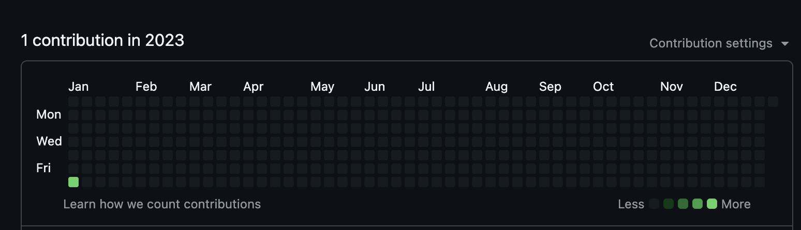

^ Justamente los años de la explosión de la IA

---

# PedidosYa 
### 2025

^ Cuando llegué a PedidosYa y empecé a usar ChatGPT

---


---

### "Esto me va a hacer 
## por lo menos **3x**
### más productivo"

^ Cenando con amigos

---


^ Su reacción. Hoy concuerdo.

^ Si entendemos fundamentalmente como funcionan estas tecnologias, podemos ver como esta tecnologia revolucionara muchos aspectos de nuestro día, pero tal vez no tanto como se se escucha en los medios.

---

## _1. ¿De donde venimos?_


---

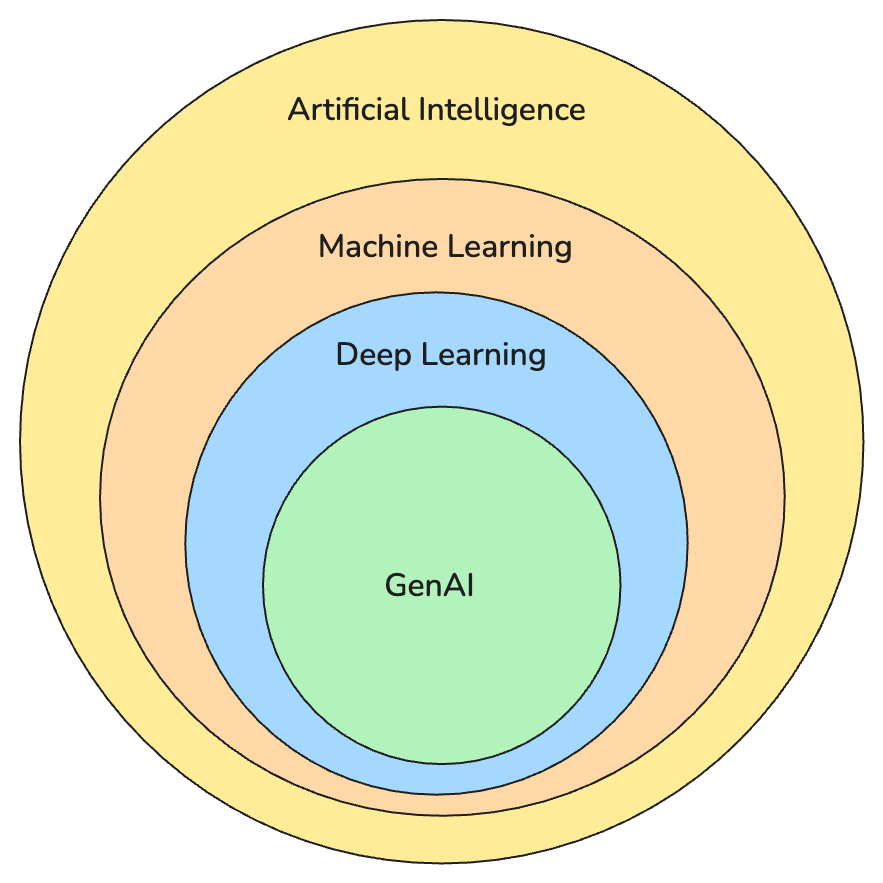

^ El campo de la inteligencia artificial existe hace decadas.

^ Larga historia de breakthroughs

---


^ "Comienza a existir" como campo de ingeniería
^ Se acuña el termino "inteligencia artificial"

---


### DeepBlue vence a Garry Kasparov (1997)

---

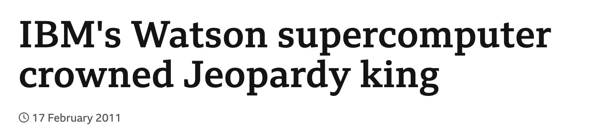

### (2011)

---

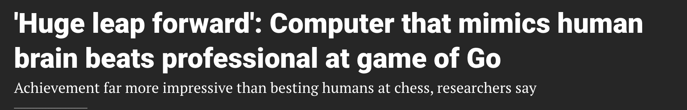

### AlphaGo vence a Lee Sedol (2016)

^ Han habido mucho de estos momentos de disrupción

^ Y el último de estos momentos es en 2022, con la introcucción

---


### (2022)

^ Han habido cambios acelerados en este espacio.

---

# Multimodal (2023)

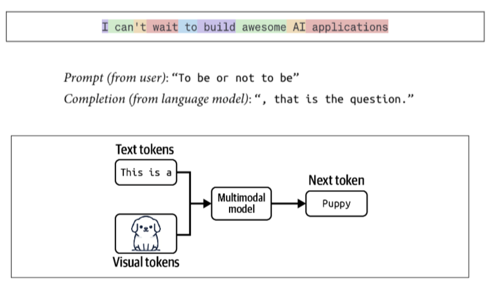

^ 

---

## Agents 
### (2024-presente)

^ Sistema que entiende su entorno, toma decisiones autónoma para alcanzar un objetivos.

---

> AI beat us at chess. AI beat us in Jeopardy. No one freaked out and ran for the hills. It only made headlines when AI figured out how to write your term paper.
-- Neil deGrasse Tyson

---

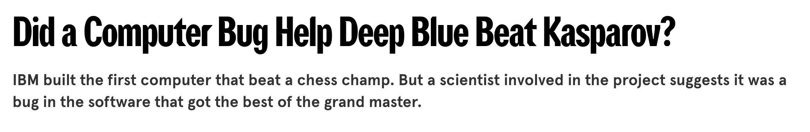

---


# Jeopardy category: US Cities

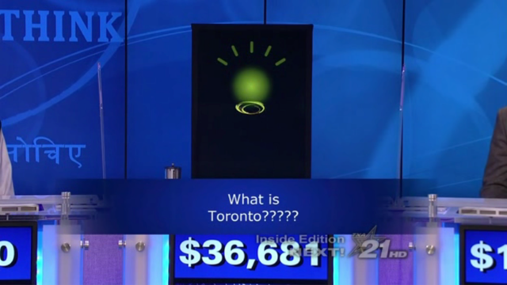

^ Su aeropuerto más grande fue nombrado en honor a un héroe de la Segunda Guerra Mundial.”

^ Hay algo decepcionante al usar AI.

^ Cuando falla, falla espectacularmente.

---

> Machine-learning algorithms may have fundamental problems with reasoning about “purposiveness” and intended uses.
-- David Autor "Why Are There Still So Many Jobs?"

^ Dificil de razonar sobre el proposito y casos de uso

---


^ Decepción al usar.

---

# [fit] Don't Believe 
# [fit] **The Hype**

-- Public Enemy 

^ Hay mucho headline
^ Cuando hablo con ingenieros, lo siento mucho mas aterrizado

---

# [fit] _2. ¿Hacia donde_
# _vamos?_

### aka jugando al oráculo

^ Hay tendencias que son relevantes de resaltar

---

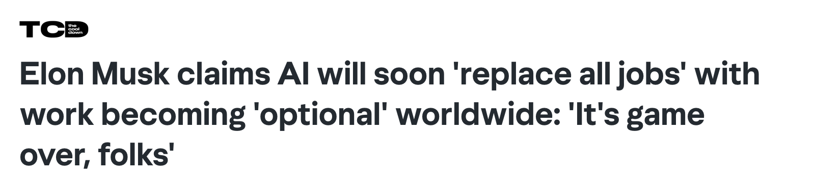

---


^ La realidad nos dice otra cosa

---

> Overall employment-to-population ratios remained broadly stable in advanced economies.
-- David Autor "Why Are There Still So Many Jobs?"

---

> In 1900, 40% of all US employment was on farms. Today, it's less than 2%. It's not because we're eating less.
-- David Autor, Why Are There Still So Many Jobs?

^ Un par de agricultores pueden alimentar a 320 millones de personas

^ En el macro es asi.

^ Pero como sabemos los chilenos, que en el macro estemos bien, no significa que los individuos estén bien.

^ Pero cuales trabajos van a ser eliminados, y que efecto tiene eso en la sociedad?

^ ¿Por qué mas automatizacion no reduce la cantidad de trabajos?

---

## [fit] la **complejidad** de un sistema 
### no desaparece, 
# [fit] se **traslada**

^ Historia de capas de abstracción para esconder la complejidad de los sistemas

^ Esa complejidad se traslada en innovación, mayor potencial para invertir en otras cosas, mayor productividad.


---


^ Podemos ver eso en la evolución de los lenguajes de programación

---

```
LOAD R1, #10
ADD  R2, R1
JMP  LOOP
```

^ Carga y manejo de memoria manual.

^ Dificultad de expresar cosas complejas

---

```swift
struct TodoListView: View {
    @State private var items = [
        "Buy groceries",
        "Do laundry",
        "Finish SwiftUI feature"
    ]
    
    var body: some View {
        List(items, id: \.self) { todo in
            HStack {
                Text(todo)
            }
        }
    }
}
```

^ Describir como se tiene que ver la vista basado en el estado

---

## GenAI es la 
### siguiente **capa de abstracción**

^ Crear una función que haga que, dado un input, me de un output, es trivial hoy

^ ¿Cual es el valor que tenemos como humanos?

---

### El diseño y arquitectura de software 
## tiene más valor

---

# [fit] ¿Cómo evolucionamos 
## [fit] _sistemas complejos?_

^ ¿Cómo hacemos que los humanos puedan mantenerse eficientes interactuando con sistemas cada vez más complejos?

---

### [fit] ¿Cómo lo estamos haciendo
# [fit] en PedidosYa?

^ No solo en ingeniería, sino en otros ámbitos de la empresa

---

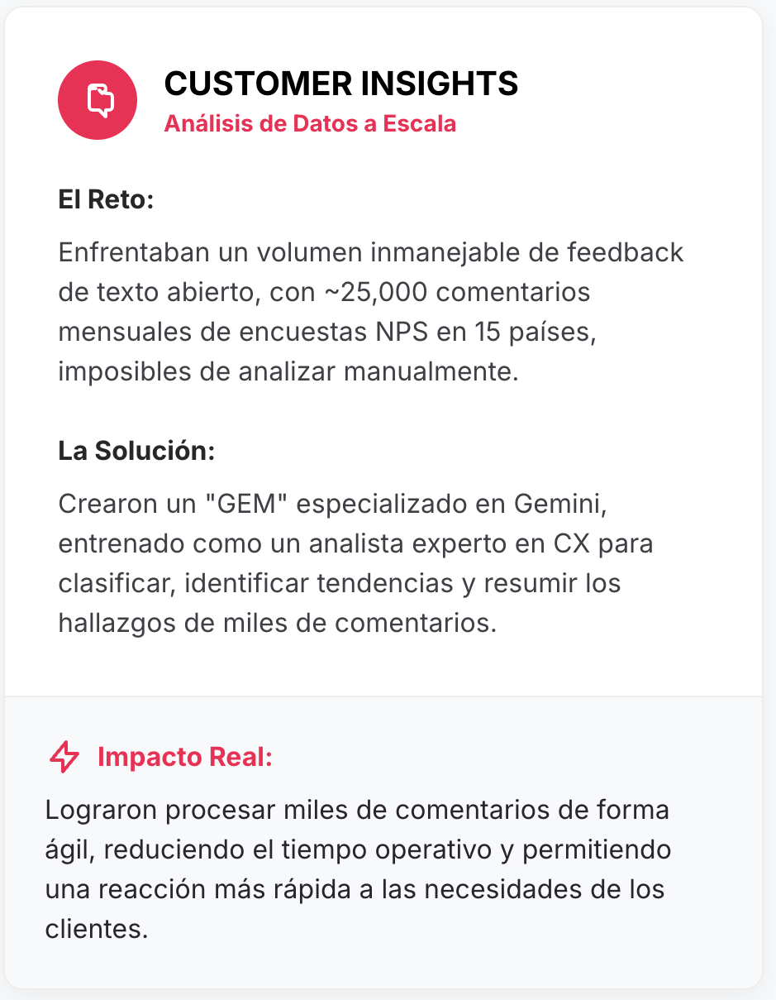

^ Analizar 25.000 comentarios

^ Crearon una GEM de gemini para identificar tendencias y resumir el feedback

---

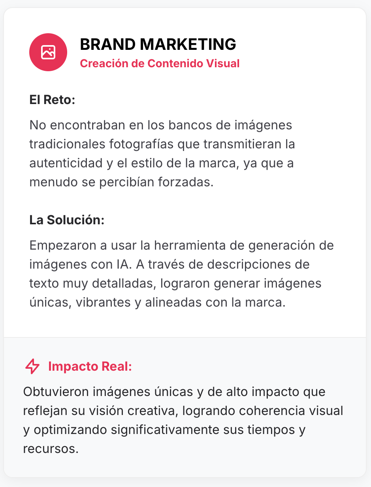

^ Ilustraciones y generación de imagenes enfocadas en PedidosYa

---

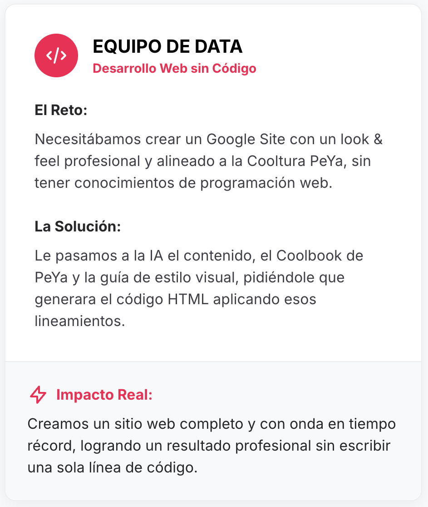

^ Generación de sitios web, sin habilidades de codeo.

---

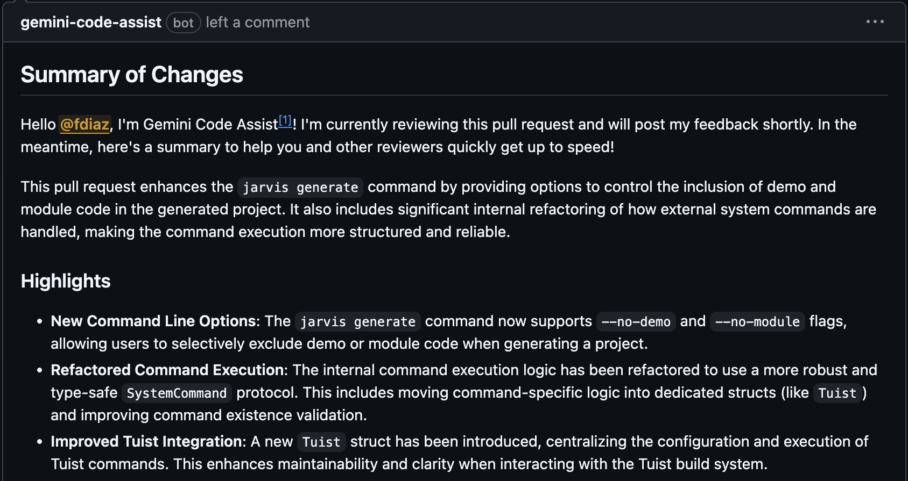

^ Code reviews

---


^ Uno de los problemas en empresas grandes es el acceso a la información

^ Creamos Pipo: un asistente que, por Slack, puede ayudarte a encontrar la info que necesites

^ Conectado a People, Tech, HR, Travel, etc.

---

# Algunos consejos

---


^ Joaco "apaga la tele"

^ Tenemos que seguir entendiendo como funcionan

^ Y esto se ve reflejado en como utilizamos estos asistentes:

---

```swift
import SwiftUI

struct ConferenceView: View {
    var body: some View {
        Text("Hello, 9punto5!")
            .frame(maxWidth: .infinity, maxHeight: .infinity)
            .background(Color.red)
            .foregroundColor(.white)
    }
}
```

^ background color sea variable

^ Dos opciones para hacer esto

---
[.text: #00000, alignment(left), text-scale(0.4), Avenir Next Regular]

 I want you to refactor this view with the following requirements:

1.	Make the background color configurable:
• Add a property or initializer parameter that allows me to pass in any Color as the background.
• Provide a sensible default color if none is passed in (for example, Color.blue).
2.	Keep the layout behavior identical:
• The view should still expand to fill the available space (i.e., use frame(maxWidth: .infinity, maxHeight: .infinity)).
• The text should remain centered.
3.	Text styling:
• Keep the text as "Hello, 9punto5!"
5.	Code quality / style:
• Use idiomatic Swift and SwiftUI style.
• Keep the implementation simple and self-contained (no unnecessary abstractions or external dependencies).
• Don’t add comments unless they are really necessary; the code should be self-explanatory.

Please provide the complete, updated SwiftUI view implementation that meets all of these requirements.

^ Podemos hacer un prompt

---
[.code-highlight: 4-8, 13]

```swift
import SwiftUI

struct ConferenceView: View {
    let backgroundColor: Color

    init(backgroundColor: Color = .red) {
        self.backgroundColor = backgroundColor
    }

    var body: some View {
        Text("Hello, 9punto5!")
            .frame(maxWidth: .infinity, maxHeight: .infinity)
            .background(backgroundColor)
            .foregroundColor(.white)
    }
}
```

---

## No reemplaces pensar

---

### No te vuelvas 
# obsoleto

^ No hacerte a ti mismo obsoleto

---

"Esto fue creado con IA, puede contener errores"

^ La persona que se vuelve obsoleta, es la que usó gen AI para escribir el doc

---

"Authored by Francisco, co-piloted by AI. If anything here is wrong, blame the human. The AI is just here for the vibes."

^ No podemos culpar a una máquina de nuestros errores

---

# [fit] Conclusión

##### shameless plug incoming

---

## [fit] En la industria seguiremos necesitando 
# [fit] _gente_ creativa

---

## [fit] En PedidosYa seguimos buscando 
# [fit] _gente_ creativa

---


#### https://empleos.pedidosya.com
